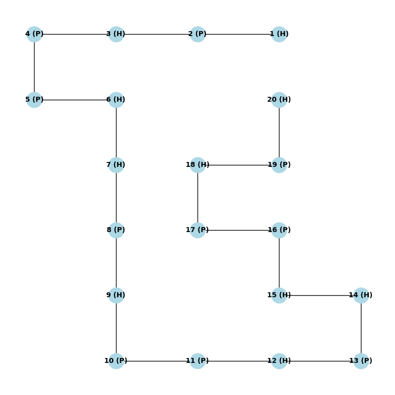

Protein folding Monte Carlo
M2BI - 2024
==============
M2BI Dounia BENYAKHLAF (22007439)\
\
This project implements protein folding using the Replica Exchange Monte Carlo algorithm, as presented in the paper by [Chris Thachuk et al. (2007)](https://bmcbioinformatics.biomedcentral.com/articles/10.1186/1471-2105-8-342).

## Installation

### Steps
1. Clone the repository:
```
git clone git@github.com:DouniaBenyakhlaf/protein-folding-monte-carlo.git
```
2. Navigate into the project directory:
```
cd protein-folding-monte-carlo/
```
3. Create conda environment and install dependendies:
```
conda env create -f environment.yml
```
4. Load conda environment:
```
conda activate montecarlo-env
```
## Running the Application
1. Move into the src directory:
```
cd src
```
2. Then, run the test.py script:
```
python3 test.py
```
You will then be prompted to test the algorithm on some pre-provided examples. You can also test it on your own protein sequence. 2D representations using `PyMOL` scripts or `Networkx` graph images will be available in the `results` repository at the end of the algorithm's execution.To view the 2D representation in PyMOL, launch the `PyMOL` application and open the `.pml` file of your choice.

#### Examples:
2D representations of replica 4 after running the algorithm on protein 1

<video width="640" height="360" controls>
  <source src="https://example.com/video.mp4" type="video/mp4">
  Your browser does not support the video tag.
</video>


