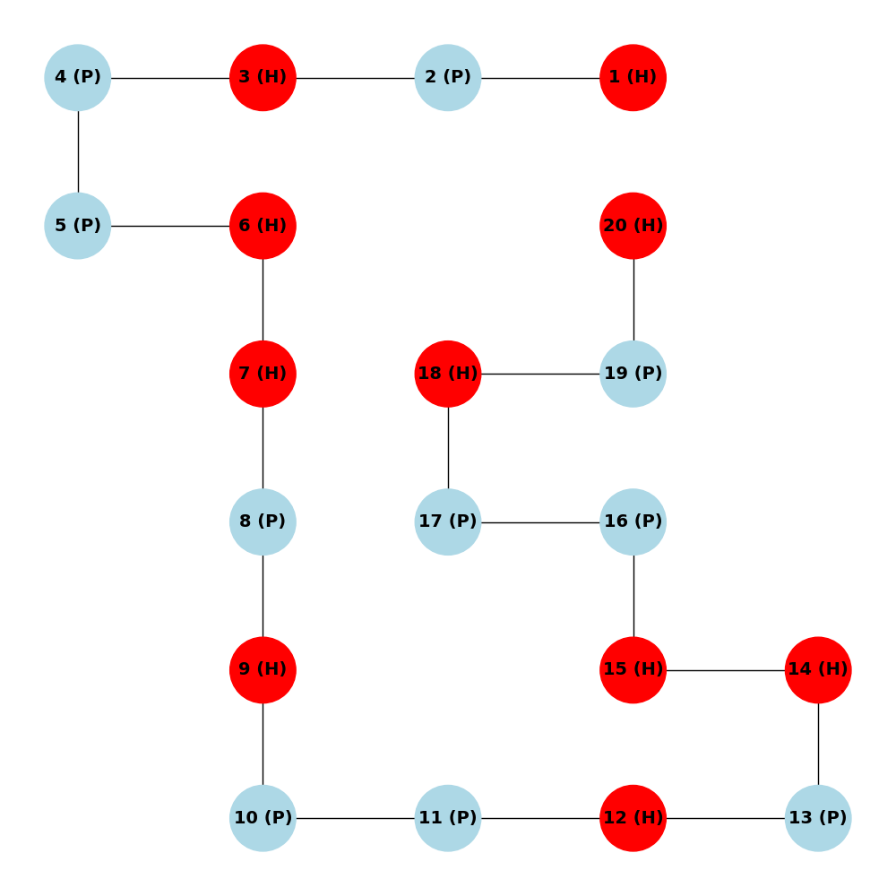

Protein folding Monte Carlo
M2BI - 2024
==============
M2BI Dounia BENYAKHLAF (22007439)\
\
This project implements protein folding using the Replica Exchange Monte Carlo algorithm, as presented in the paper by [Chris Thachuk et al. (2007)](https://bmcbioinformatics.biomedcentral.com/articles/10.1186/1471-2105-8-342).

## Installation

### Steps
1. Clone the repository:
```
git clone git@github.com:DouniaBenyakhlaf/protein-folding-monte-carlo.git
```
2. Navigate into the project directory:
```
cd protein-folding-monte-carlo/
```
3. Create conda environment and install dependendies:
```
conda env create -f environment.yml
```
4. Load conda environment:
```
conda activate montecarlo-env
```
## Running the Application
1. Move into the src directory:
```
cd src
```
2. Then, run the test.py script:
```
python3 test.py
```
You will then be prompted to test the algorithm on some pre-provided examples. You can also test it on your own protein sequence. 2D representations using `PyMOL` scripts or `Networkx` graph images will be available in the `results` repository at the end of the algorithm's execution.To view the 2D representation in PyMOL, launch the `PyMOL` application and open the `.pml` file of your choice.

#### Examples:

| Protein | length | Energy | Sequence (H/P) |
|----------|----------|----------|----------|
| 1 | 20 | -9 | (HP)2PH2PHP2HPH2P2HPH |
| 2 | 24 | -9 | H2(P2H)7H |
| 3 | 25 | -8 | P2HP2(H2P4)3H2 |
| 4 | 36 | -14 | P3H2P2H2P5H7P2H2P4H2P2HP2 |
| 5 | 48 | -23 | P2H(P2H2)2P5H10P6(H2P2)2HP2H5 |
| 6 | 50 | -21 | H2(PH)3PH4PH(P3H)2P4H(P3H)2PH4(PH)4H |
| 7 | 60 | -36 | P2H3PH8P3H10PHP3H12P4H6PH2PHP |
| 8 | 64 | -42 | H12(PH)2(P2H2)2P2HP2H2PPH2P2HP2(H2P2)2(HP)2H12 |
| 9 | 85 | -53 | H4P4H12P6(H12P3)3HP2(H2P2)2HPH |
| 10 | 100 | -50 | P3H2P2H4P2H3(PH2)2PH4P8H6P2H6P9HPH2PH11P2H3PH2PHP2HPH3P6H3 |
| 11 | 100 | -48 | P6HPH2P5H3PH5PH2P4H2P2H2PH5PH10PH2PH7P11H7P2HPH3P6HPH2 |


2D representations of replica 4 after running the algorithm on protein 1

Representation of the final state of replica 4 using Networkx.

Representation of the final state of replica 4 using PyMOL.

